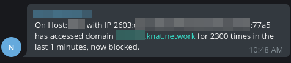

# AutoRL

This is a PoC of automatically block traffic on Cloudflare's side based on Nginx Log parsing.

It will evaluate Nginx access.log and find potential CC pattern, and block them on Cloudflare's side and send a message to Telegram Group.

## Topology

With Cloudflare Argo Tunnel, we can set security group to allow inbound traffic for SSH only, this can guarantee the Host's IP will not be exposed to the Internet (ref: [使用 Cloudflare Argo Tunnel(cloudflared) 来加速和保护你的网站](https://nova.moe/accelerate-and-secure-with-cloudflared/)), however, attackers can still CC your website by sending enormous requests cocurrently, AutoRL is here trying to mitigate this problem.


## Prerequisites

Since this is only a PoC, the following condition must be met to use AutoRL.

* Python 3 installed on Host
* Nginx used for Reverse proxy and all the logs are logged into one `access.log` file.
* Nginx has the following log format (in `/etc/nginx/nginx.conf`)

    ```
    log_format  main  '$remote_addr $time_iso8601 "$request" '
                        '$status $body_bytes_sent "$http_referer" '
                        '"$http_user_agent" "$http_x_forwarded_for"';
    ```
    On this condition, the raw log should look like this:
    ```
    172.70.211.101 2022-05-02T10:44:16+08:00 "GET /grafana/api/live/ws HTTP/1.1" 400 12 "-" "Mozilla/5.0 (X11; Linux x86_64) AppleWebKit/537.36 (KHTML, like Gecko) Chrome/103.0.5028.0 Safari/537.36" "145.xx.xx.xxx"
    ```
    Where, `172.70.211.101` is Cloudflare's IP, `2022-05-02T10:44:16+08:00` stands for request datetime and `"145.xx.xx.xxx"` is the real visitor IP.


## Usage

1. Download the `autorl.py` to your host
2. Edit the following variable in the `autorl.py`

    * CF_EMAIL (Your Cloudflare login email)
    * CF_AUTH_KEY (Your Cloudflare Global API Key)
    * ACCESS_LOG_PATH (Default is `/var/log/nginx/access.log`)
    * INTERVAL_MIN (Default is 1, then this script will evaluate for 1min's traffic)
    * RATE_PER_MINUTE (How many requests are allowed for single IP, e,g, when this is set to 600 and `INTERVAL_MIN` is 1, then one IP can send at most 600 requests, after that, this IP will be blocked.)
    * TG_CHAT_ID (Your Telegram Chat Group ID)
    * TG_BOT_TOKEN (You should invite a bot to your group, and fillin the bot token here)
    * IP_WHITE_LIST (If you'd like to whitelist some IP, fillin here)
3. Create a crontab for this script, example:
    ```
    * * * * * for i in {1..6}; do /usr/bin/python3 /path/to/autorl.py & sleep 10; done
    ```

## Demo

On Telegram side:



On Cloudflare side:


## Notes

* Blocked IP address will never gets unblocked.
* If logrotate is not setup correctly, then parsing the whole `access.log` might consume a lot of system resources.
* The attack pattern/sample is not stored so we have no idea how the attack is conducted.